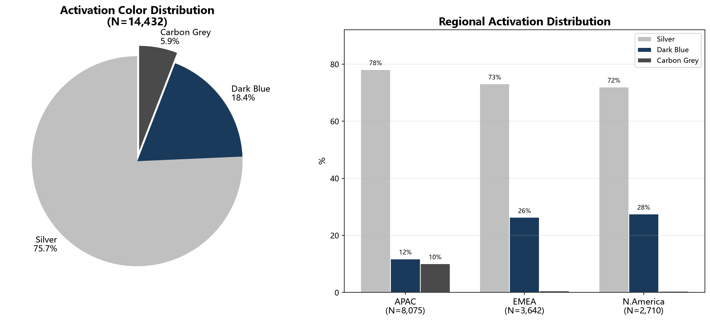
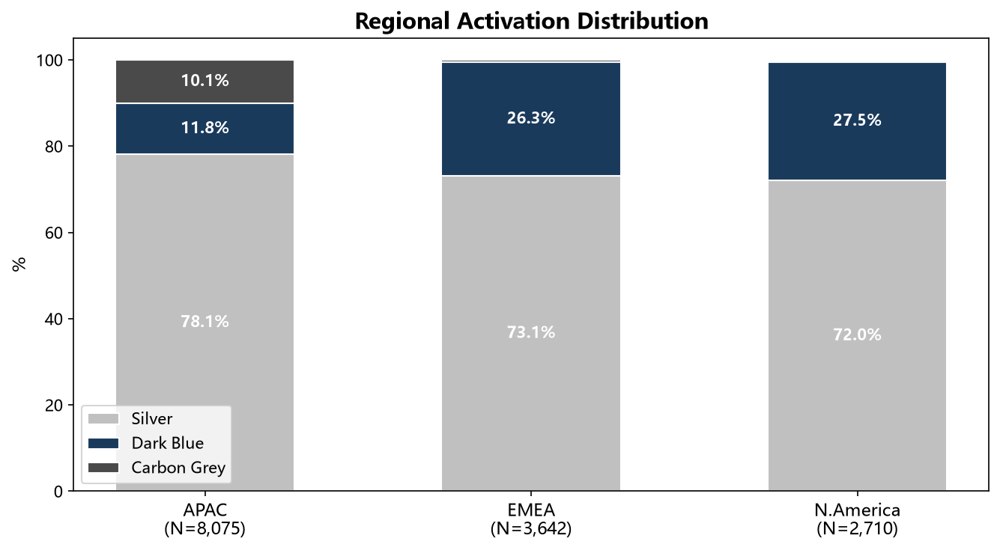
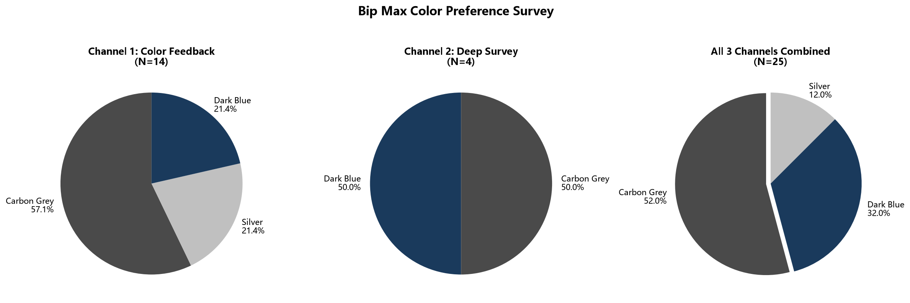
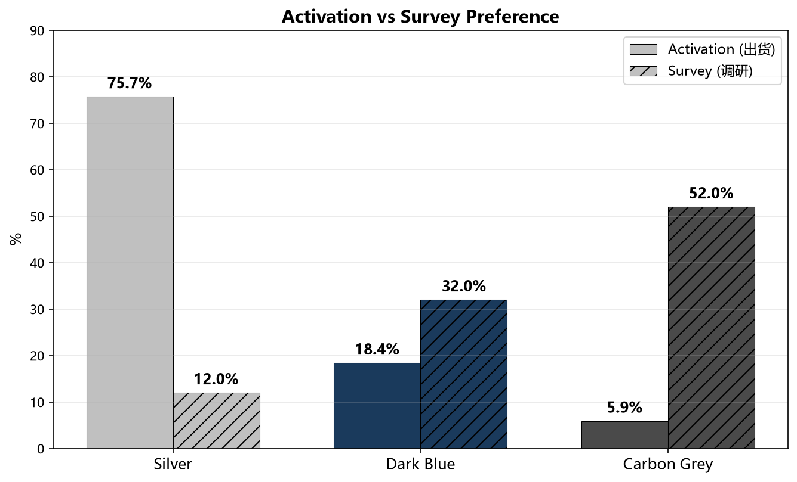
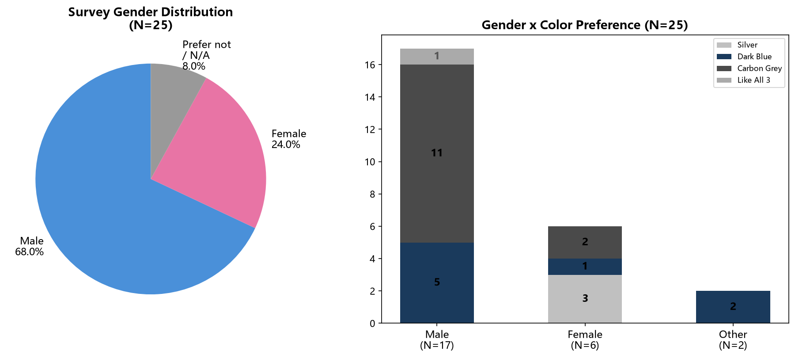
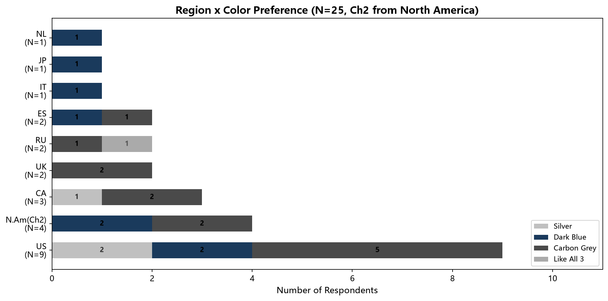

# Bip Max 颜色偏好调研分析报告

> **调研日期**: 2026年6月 | **数据截止**: 2026-06-24
> **调研团队**: Bip Max 产品团队

---

## 📋 目录

1. [调研概述](#1-调研概述)
2. [当前激活颜色分布（出货数据）](#2-当前激活颜色分布)
3. [用户颜色偏好调研](#3-用户颜色偏好调研)
4. [性别维度分析](#4-性别维度分析)
5. [地域维度分析](#5-地域维度分析)
6. [多维度交叉分析](#6-多维度交叉分析)
7. [用户定性反馈](#7-用户定性反馈)
8. [关键发现与建议](#8-关键发现与建议)
9. [附录：原始数据](#9-附录原始数据)

---

## 1. 调研概述

### 1.1 调研背景

Bip Max 目前在售三款颜色：**Silver（银色）、Dark Blue（深蓝）、Carbon Grey（碳灰）**。

当前出货备货以 Silver 为主，但用户实际偏好是否与出货匹配需要通过调研验证。

### 1.2 数据来源

| 数据来源 | 类型 | 样本量 | 说明 |
|---------|------|--------|------|
| 激活数据 | 定量 | 14,432 台 | 全球已激活 Bip Max 颜色分布 |
| 颜色反馈问卷 (渠道1) | 定量+定性 | 14 份 | Email 定向发送，含性别/地域 |
| 颜色偏好深度问卷 (渠道2) | 定量+定性 | 5 份 | 含多维购买偏好深度调研 |
| Week 1 产品问卷 | 定量 | 9 份 | Bip Max 早期体验者反馈 |

> ⚠️ **样本量说明**: 调研共发送 3,000+ 封邮件，合并两个渠道共回收 **19 份有效颜色偏好回答**（渠道1: 14份，渠道2: 5份）。回复率约 **0.6%**。由于样本量较小，调研结果作为方向性参考，建议结合更大规模调研或 A/B 测试验证。

### 1.3 三款颜色对照

| 颜色 | 英文名 | 描述 |
|------|--------|------|
| 🥈 银色 | Silver | 经典金属质感，浅色系 |
| 🔵 深蓝 | Dark Blue | 沉稳商务风，中等色调 |
| ⚫ 碳灰 | Carbon Grey | 低调运动风，深色系 |

---

## 2. 当前激活颜色分布

### 2.1 全球总体分布

> **数据来源**: 激活数据库统计（截至 2026-06-24），口径：产品名包含 `Amazfit_Bip Max`，颜色 = Silver / Dark Blue / Carbon Grey

| 颜色 | 激活数量 | 占比 |
|------|---------|------|
| Silver (银色) | 10,925 | **75.7%** |
| Dark Blue (深蓝) | 2,661 | **18.4%** |
| Carbon Grey (碳灰) | 846 | **5.9%** |
| **合计** | **14,432** | **100%** |

📊 **[图表 1]** 激活颜色分布饼图 & 分区域柱状图

### 2.2 分区域分布

| 区域 | 总激活数 | Silver | Dark Blue | Carbon Grey |
|------|---------|--------|-----------|-------------|
| 🌏 亚太 (APAC) | 8,075 | 6,307 (78.1%) | 955 (11.8%) | 813 (10.1%) |
| 🌍 EMEA | 3,642 | 2,662 (73.1%) | 959 (26.3%) | 21 (0.6%) |
| 🌎 北美 (NA) | 2,710 | 1,952 (72.0%) | 746 (27.5%) | 12 (0.4%) |

**区域关键发现：**
- APAC 是最大市场（占总量 56%），且 Carbon Grey 激活占比最高（10.1%）
- EMEA 和北美 Carbon Grey 激活极少（<1%），可能受供货影响
- 北美 Dark Blue 占比最高（27.5%）

📊 **[图表 7]** 区域激活颜色分布详情

---

## 3. 用户颜色偏好调研

### 3.1 渠道一：Bip Max 颜色反馈问卷 (N=14)

| 颜色 | 选择人数 | 占比 |
|------|---------|------|
| Carbon Grey (碳灰) | 8 | **57.1%** |
| Silver (银色) | 3 | **21.4%** |
| Dark Blue (深蓝) | 3 | **21.4%** |

### 3.2 渠道二：深度颜色偏好问卷 (N=5)

**Bip Max 三选一：**

| 颜色 | 选择人数 | 占比 |
|------|---------|------|
| Dark Blue (深蓝) | 2 | **50.0%** |
| Carbon Grey (碳灰) | 2 | **50.0%** |
| Silver (银色) | 0 | 0% |
| *(未回答)* | 1 | - |

**用户日常购表颜色偏好（开放题）：**

| 偏好颜色 | 选择人数 |
|---------|---------|
| Blue | 2 |
| Black | 2 |
| Gold | 1 |

**多选：购表时会考虑的颜色 (N=5)：**

| 颜色 | 勾选人数 | 占受访者比例 |
|------|---------|------------|
| Grey | 4 | 80% |
| Black | 4 | 80% |
| Blue | 3 | 60% |
| Silver | 3 | 60% |
| Green | 1 | 20% |

### 3.3 Week 1 产品体验问卷 (N=8，有颜色偏好回答)

| 偏好颜色 | 选择人数 | 占比 |
|---------|---------|------|
| 银色 (Silver) | 5 | **62.5%** |
| 黑色 (Black) | 3 | **37.5%** |

> 注：Week 1 问卷的"偏好颜色"问题来自产品整体评价（不是专门的颜色调研），5人选银色、3人选黑色。

### 3.4 综合调研结果（渠道1 + 渠道2，N=18）

| 颜色 | 选择人数 | 占比 |
|------|---------|------|
| Carbon Grey (碳灰) | 10 | **55.6%** |
| Dark Blue (深蓝) | 5 | **27.8%** |
| Silver (银色) | 3 | **16.7%** |

📊 **[图表 2]** 三渠道颜色偏好饼图

### ⚡ 激活 vs 调研对比

| 颜色 | 激活占比 | 调研偏好占比 | 差异 |
|------|---------|------------|------|
| Silver | **75.7%** | 16.7% | ↓ 59.0pp |
| Dark Blue | 18.4% | 27.8% | ↑ 9.4pp |
| Carbon Grey | 5.9% | **55.6%** | ↑ 49.7pp |

📊 **[图表 5]** 激活 vs 调研偏好对比图

> 🔴 **核心发现**: 当前出货以 Silver 为主 (75.7%)，但调研显示用户最偏好 Carbon Grey (55.6%)。**Carbon Grey 的供需存在显著错配。**

---

## 4. 性别维度分析

### 4.1 调研人群性别分布

| 性别 | 人数 | 占比 |
|------|------|------|
| Male (男) | 13 | **72.2%** |
| Female (女) | 4 | **22.2%** |
| Prefer not to say | 1 | 5.6% |

### 4.2 性别 × 颜色偏好（颜色反馈问卷，N=14）

| 性别 | Carbon Grey | Dark Blue | Silver | 合计 |
|------|-------------|-----------|--------|------|
| **Male (男)** | 7 (87.5%) | 1 (12.5%) | 0 | 8 |
| **Female (女)** | 1 (25%) | 0 | 3 (75%) | 4 |
| Prefer not to say | 0 | 1 | 0 | 1 |

📊 **[图表 3]** 性别 × 颜色偏好图

**性别维度关键发现：**
- **男性用户强烈偏好 Carbon Grey**（87.5%），对 Silver 选择为零
- **女性用户偏好 Silver**（75%），但也有 25% 选择 Carbon Grey
- Dark Blue 在男性中有少量偏好（12.5%），女性中无选择
- 深度问卷（渠道2）5位全为男性，进一步确认男性对 Carbon Grey 和 Dark Blue 的偏好

---

## 5. 地域维度分析

### 5.1 颜色反馈问卷地域分布（N=14）

| 国家/地区 | 总人数 | Carbon Grey | Dark Blue | Silver |
|-----------|--------|-------------|-----------|--------|
| 🇺🇸 United States | 8 | 5 (62.5%) | 1 (12.5%) | 2 (25.0%) |
| 🇨🇦 Canada | 3 | 2 (66.7%) | 0 | 1 (33.3%) |
| 🇯🇵 Japan | 1 | 0 | 1 (100%) | 0 |
| 🇬🇧 United Kingdom | 1 | 1 (100%) | 0 | 0 |
| 🇳🇱 Netherlands | 1 | 0 | 1 (100%) | 0 |

📊 **[图表 4]** 地域 × 颜色偏好图

**地域维度关键发现：**
- **北美（US+Canada）是主要回复来源**（11/14，78.6%），Carbon Grey 偏好最高
- 欧洲（UK+Netherlands）样本太小，无法结论，但显示对深色系偏好
- 日本回复者选择了 Dark Blue

### 5.2 激活数据 vs 调研数据（北美市场）

| 颜色 | 北美激活占比 | 北美调研偏好 | 差异 |
|------|------------|------------|------|
| Silver | 72.0% | 27.3% | ↓ 44.7pp |
| Dark Blue | 27.5% | 9.1% | ↓ 18.4pp |
| Carbon Grey | 0.4% | **63.6%** | ↑ 63.2pp |

> 🔴 **北美市场 Carbon Grey 供需错配最为严重**：激活仅 0.4%，但调研中 63.6% 偏好 Carbon Grey。

---

## 6. 多维度交叉分析

### 6.1 年龄 × 颜色（深度问卷，N=5）

| 年龄段 | 人数 | Bip Max 颜色选择 |
|--------|------|-----------------|
| 45-54 | 2 | Carbon Grey / Dark Blue |
| 65-74 | 2 | Dark Blue / *(未选)* |
| >74 | 1 | Carbon Grey |

> 样本量太小，年龄趋势需更大规模调研验证。

### 6.2 表盘形状偏好（深度问卷，N=5）

| 形状 | 选择人数 |
|------|---------|
| Round (圆形) | 3 |
| Rectangle (矩形) | 1 |
| Square (方形) | 1 |

### 6.3 颜色 vs 其他购买因素优先级（深度问卷）

**"颜色是购买手表的首要因素"：**
- Disagree: 4/5 (80%)
- 颜色选择虽重要，但多数受访者认为功能和价格比颜色更重要

**"即使颜色不喜欢，也会购买功能好、价格合理的手表"：**
- Strongly Disagree: 3/5
- Disagree: 1/5
- Undecided: 0
- Agree: 1/5

> 💡 颜色是重要的购买决策因素，但不是首要因素。大多数用户不会仅因为颜色而拒绝购买，但颜色是影响选择的关键门槛。

---

## 7. 用户定性反馈

### 7.1 选择 Carbon Grey 的原因

| 受访者 | 反馈 |
|--------|------|
| User 36056 | "我认为这是这款手表风格中最好看的颜色" |
| User 98773 | "相比其他两个颜色更喜欢它，但这三个颜色我都可以接受" |

### 7.2 选择 Dark Blue 的原因

| 受访者 | 反馈 |
|--------|------|
| User 91715 | "看起来最高级和低调" (Looks the most premium and understated) |
| User 28810 | "我喜欢的颜色" (My favorite color) |

### 7.3 Week 1 产品体验者对颜色的反馈

- **外观颜色评价**: 绝大多数评价"非常好"（6/9）或"好"
- **红色按键满意度**: 多数不喜欢红色按键（5/9），建议更换颜色
- **按键改进建议**: 多人建议"更换颜色"，认为红色按键显得廉价 (looks cheap)

---

## 8. 关键发现与建议

### 🔴 核心发现

1. **供应链错配严重**：
   - 当前 75.7% 出货为 Silver，但仅 16.7% 调研用户偏好 Silver
   - Carbon Grey 出货仅 5.9%，但 55.6% 调研用户偏好 Carbon Grey
   - **建议：大幅提升 Carbon Grey 备货比例**

2. **性别差异显著**：
   - 男性（占调研人群 72%）极度偏好 Carbon Grey (87.5%)
   - 女性偏好 Silver (75%)，但也接受 Carbon Grey
   - **建议：Carbon Grey 作为主力色，Silver 保留供女性用户选择**

3. **区域差异**：
   - 北美 Carbon Grey 需求最大但供货最少（激活仅 0.4%）
   - APAC 已有 10.1% Carbon Grey 激活，基础较好
   - **建议：优先在北美和 EMEA 增加 Carbon Grey 供货**

4. **Dark Blue 是稳定中间选择**：
   - 调研中 27.8% 选择 Dark Blue，且男女均有偏好
   - 激活 18.4%，差异相对合理
   - **建议：Dark Blue 维持现比例或小幅提升**

### 🟡 建议优先级

| 优先级 | 行动项 | 预期影响 |
|--------|--------|---------|
| 🔴 P0 | 将 Carbon Grey 备货比例从 6% → 35-40% | 满足主流用户偏好 |
| 🔴 P0 | Silver 备货从 76% → 35-40% | 避免 Silver 库存积压 |
| 🟠 P1 | 北美/EMEA 优先铺货 Carbon Grey | 抢占偏好用户市场 |
| 🟡 P2 | 考虑推出更多深色系配色选项 | 调研显示 Black/Grey/Blue 受青睐 |
| 🟡 P2 | 改进/取消红色按键设计 | 多数调研用户反馈负面 |

### ⚠️ 风险与局限

- **样本量小**（N=19）：回复率 0.6%，可能存在自选偏差（喜欢深色的用户更愿意回复）
- **地域偏差**：调研回复主要来自北美（78.6%），APAC 用户声音不足
- **建议**：结合更大规模的用户调研、A/B 测试或销售数据验证后调整策略

---

## 9. 附录：原始数据

### 9.1 激活数据原始表

**全球汇总：**
| 颜色 | 激活数量 | 占比 |
|------|---------|------|
| Silver | 10,925 | 75.70% |
| Dark Blue | 2,661 | 18.44% |
| Carbon Grey | 846 | 5.86% |
| **合计** | **14,432** | **100%** |

**区域明细：**

| 区域 | 标准版本 | Silver | Dark Blue | Carbon Grey |
|------|---------|--------|-----------|-------------|
| 亚太 | 亚太版 | 5,971 | 853 | 785 |
| EMEA | 欧洲版 | 2,598 | 946 | 20 |
| 北美 | 北美版 | 1,874 | 722 | 11 |
| 亚太 | 北美版(跨境) | 303 | 90 | 14 |
| 亚太 | 亚太版(跨境) | 55 | 5 | 0 |
| EMEA | 亚太版(跨境) | 46 | 1 | 0 |
| 北美 | 欧洲版(跨境) | 23 | 19 | 0 |
| 亚太 | 欧洲版(跨境) | 22 | 6 | 14 |
| 北美 | 北美版(跨境) | 4 | 0 | 0 |
| 其他 | 跨境混合 | 29 | 19 | 2 |

### 9.2 颜色反馈问卷原始数据（14条）

| # | 提交时间 | 性别 | 国家 | 选择颜色 |
|---|---------|------|------|---------|
| 5 | 2026-06-08 20:57 | Female | United States | Silver |
| 6 | 2026-06-08 22:01 | Male | United States | Dark Blue |
| 7 | 2026-06-08 23:09 | Male | United States | Carbon Grey |
| 8 | 2026-06-08 23:24 | Male | United States | Carbon Grey |
| 9 | 2026-06-08 23:55 | Male | United States | Carbon Grey |
| 10 | 2026-06-09 01:01 | Female | Canada | Silver |
| 11 | 2026-06-09 01:10 | Male | Canada | Carbon Grey |
| 12 | 2026-06-09 01:14 | Male | United States | Carbon Grey |
| 13 | 2026-06-09 08:19 | Male | United States | Carbon Grey |
| 14 | 2026-06-09 11:29 | Female | Canada | Carbon Grey |
| 15 | 2026-06-11 22:34 | Female | United States | Silver |
| 16 | 2026-06-15 21:04 | Prefer not to say | Japan | Dark Blue |
| 17 | 2026-06-23 17:22 | Male | United Kingdom | Carbon Grey |
| 18 | 2026-06-24 01:40 | *(未填)* | Netherlands | Dark Blue |

### 9.3 深度颜色偏好问卷原始数据（5条）

| # | 日期 | 年龄 | 性别 | Bip Max选择 | 购表偏好色 | 表盘形状 | 多选考虑色 |
|---|------|------|------|------------|----------|---------|----------|
| 1 | 06-18 | 45-54 | Male | Dark Blue | Blue | Round | Grey, Black, Blue |
| 2 | 06-18 | 45-54 | Male | Carbon Grey | Black | Round | Black, Grey, Silver, Blue, Green |
| 3 | 06-18 | >74 | Male | Carbon Grey | Black | Rectangle | Black, Grey |
| 4 | 06-18 | 65-74 | Male | Dark Blue | Blue | Round | Silver, Grey, Black, Blue |
| 5 | 06-19 | 65-74 | Male | *(未选)* | Gold | Square | Silver |

### 9.4 Week 1 产品问卷 - 颜色偏好原始数据（8条）

| 姓名 | 外观颜色评价 | 偏好颜色 |
|------|------------|---------|
| *(匿名)* | *(未填)* | *(未填)* |
| Andrew Kaylie | 非常好 | 银色 |
| Lucie Boučková | 非常好 | 银色 |
| Nutthanon Chaiyasingha | 非常好 | 黑色 |
| Francisco Montero Hernandez | 一般 | 银色 |
| valentina | 非常好 | 银色 |
| Вадим | 非常好 | 黑色 |
| Vasily Baizov | 一般 | 黑色 |
| Александр | 非常好 | 银色 |

---

## 📎 附件清单

| 文件名 | 说明 |
|--------|------|
| `charts/chart1_activation.png` | 激活颜色分布（饼图+分区域柱状图） |
| `charts/chart2_survey_colors.png` | 三渠道调研颜色偏好饼图 |
| `charts/chart3_gender.png` | 性别分布 & 性别×颜色偏好 |
| `charts/chart4_region.png` | 地域×颜色偏好（横向堆叠图） |
| `charts/chart5_comparison.png` | 激活 vs 调研偏好对比 |
| `charts/chart6_multiselect.png` | 用户购表考虑颜色多选 |
| `charts/chart7_regional_detail.png` | 区域激活颜色分布详情 |
| `analysis.py` | 数据分析脚本 |
| `generate_charts.py` | 图表生成脚本 |

---

> 📝 **报告生成日期**: 2026年6月24日
> 📧 **数据来源**: 激活数据库 (sqllab_query_biglobal_device_sale_activate_detail_stat_final_20260623T012058.csv) + Email调研 (3000+封) + 深度问卷
